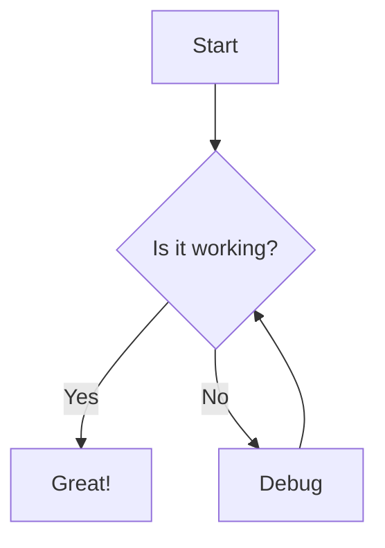

# PUPddfdfUPU title

As developers, we often need to create documentation for our projects. Markdown is a powerful yet simple tool that can help you create beautiful documentation with minimal effort.

## Creating Effective Tables

Tables can organize complex information in a readable format:

| Feature | Description | Support |
|---------|-------------|---------|
| Headers | First row is automatically formatted as header | Universal |
| Alignment | Use `:` to align content (`:---`, `:---:`, `---:`) | Most parsers |
| Complex content | Tables can contain links, code, and emphasis | Varies |

## Advanced Lists

Ordered lists with specific starting numbers:

57. You can start lists from any number
58. Markdown will continue the sequence
59. Perfect for reference documentation

Nested task lists for project management:

- Project Setup
  - [x] Create repository
  - [x] Initialize project
  - [ ] Configure CI/CD
- Development
  - [ ] Implement core features
  - [ ] Write tests

## Extended Syntax Elements

Collapsible sections (supported in GitHub and some parsers):

<details>
<summary>Click to expand</summary>

This content is hidden by default but can be expanded by the user.
Great for FAQs, large code samples, or detailed explanations.
</details>

Footnotes for references[^1]:

[^1]: This is a footnote that will appear at the bottom of the document.

## Syntax Highlighting for Various Languages

```python
def calculate_fibonacci(n):
    """Generate the Fibonacci sequence up to n."""
    a, b = 0, 1
    result = []
    while a < n:
        result.append(a)
        a, b = b, a + b
    return result

print(calculate_fibonacci(100))
```

## Diagrams with Mermaid (GitHub Supported)



## Conclusion

By mastering these advanced Markdown techniques, you can create more engaging and informative documentation for your projects. The best part is that Markdown files can be versioned alongside your code, making them easy to maintain and update. 